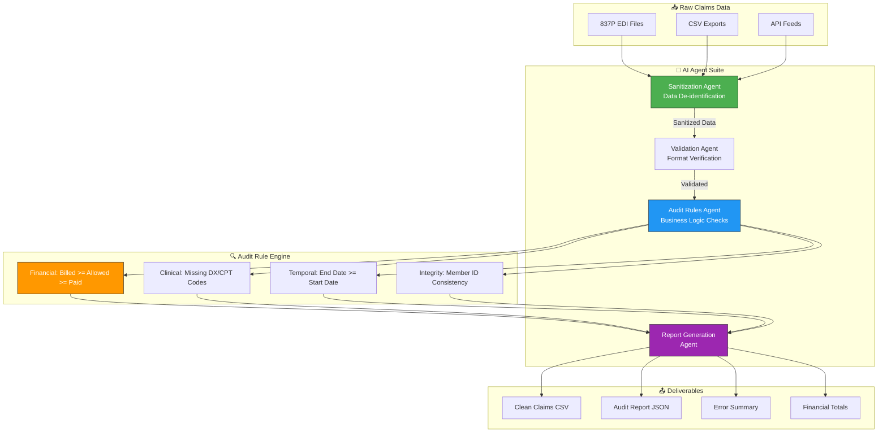
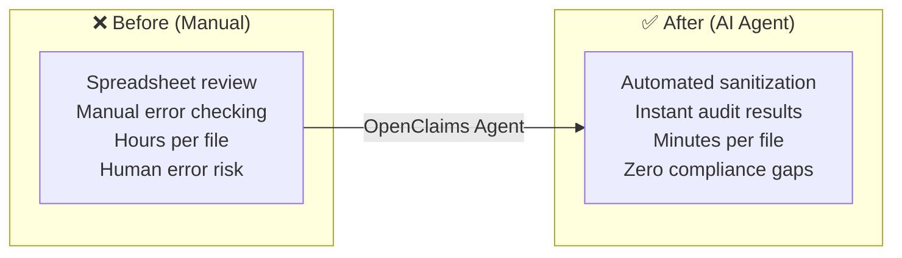

# 🏥 OpenClaims — AI Claims Intelligence & Integrity Agent

> **An autonomous AI agent for healthcare claims sanitization, auditing & integrity**  
> Solves Privacy + Integrity challenges in medical claims data.

---

## 🧠 AI Agent Architecture



## 🤖 What the AI Agents Do

| Agent | Function |
|-------|----------|
| **Sanitization Agent** | Transforms sensitive claims data into de-identified datasets — preserves relationship integrity (same Patient ID = same fake name), generates realistic CPT/ICD-10/NPI codes |
| **Validation Agent** | Verifies data structure, required fields, and format compliance before audit |
| **Audit Rules Agent** | Runs 3 categories of business rules: Financial (billed ≥ allowed ≥ paid), Clinical (missing codes), Temporal (date logic) |
| **Report Agent** | Generates comprehensive audit reports with error logs and financial summaries |

## 🔄 Before vs After



## 🛠 Tech Stack

| Component | Technology | Agent Role |
|-----------|-----------|------------|
| **Sanitizer** | Python | Data de-identification engine |
| **Auditor** | Python | Rule-based validation engine |
| **Data** | CSV / JSON | Input/output formats |
| **Deployment** | Zero-dependency Python | Portable to any environment |

## ⚡ Quick Start

```bash
# 1. Generate mock claims data (HIPAA-safe)
python claims_sanitizer.py
# Output: mock_claims_data.csv (50+ columns)

# 2. Run the audit agent
python claims_auditor.py
# Output: Console summary + audit_report.json
```

## 💡 Why This Matters

**Payment Integrity** is a billion-dollar problem in the Payer/TPA space:
- **Auditing Skills:** Catches financial leakage (overpayments, duplicate billing)
- **Data Handling:** Comfortable with wide, complex datasets (DX codes, NPIs, Tax IDs)
- **Privacy First:** Deep HIPAA understanding — sanitization before any processing

---

Built by **[Shazaly Musa](https://github.com/SparkSpheartech)** — Founder, SparkSphear Tech  
*AI Agents for Healthcare Claims Integrity*