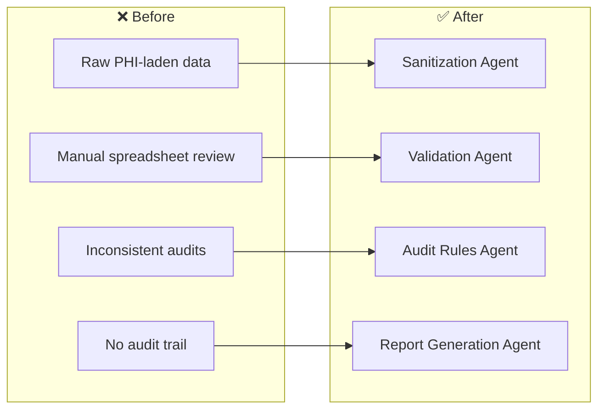
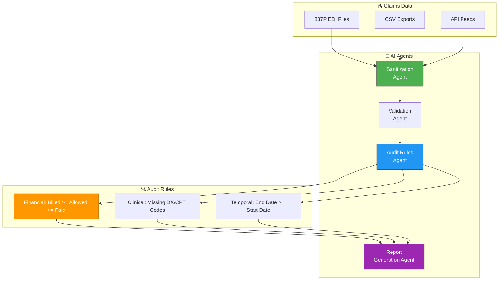

# 🏥 Healthcare Claims Intelligence — AI Agents for Claims Audit

> SPARKSPHEAR builds AI agents for healthcare claims intelligence workflows across healthcare payers, TPAs, claims departments, and risk adjustment organizations.

**Start With the Workflow. Scale What Works.**

We audit the system, connect the tools that fit, and automate the work that does not require constant manual attention.

---

## ❌ The Problem

Healthcare payers process millions of claims daily — and every one carries financial risk. Overpayments, duplicate billing, and missing diagnosis codes cost the industry billions annually. Manual audits are slow and miss patterns. The claims team does everything — and the audit plateaus.

**Before:** Manual spreadsheet audits, hours per file, inconsistent rule application, PHI exposure risk, missed overpayments, no scalable compliance.

**After (AI Agent Fleet):** Automated sanitization strips PHI while preserving data integrity, then AI audit runs three rule categories (financial, clinical, temporal) in seconds. Zero compliance gaps, every claim checked, audit-ready reports generated instantly.

---

## 🤖 AI Agent Fleet

Four AI agents that turn claims data into clean, audited, report-ready intelligence.

### Architecture

### Answer and route
The agent handles approved claims data by sanitizing protected health information, validating structure, and auditing for financial and logical errors. It captures claim details, audit rule results, and error flags — then sends the right report path or remediation alert.

### Bring clients back
Use claim-type-specific return windows (daily claim audit completion, weekly overpayment summary, monthly compliance report) to flag audit gaps and prepare compliance-approved escalation messages.

### Keep control
Overpayment recovery decisions, claim denial overrides, and PHI release approvals stay behind permissions, escalation rules, and human review. The agent assists; you remain responsible.

---

## 🚀 Start With One Workflow

We do not start by selling the biggest package. We start by auditing the workflow and identifying the smallest useful agent.

**Workflow Audit — Starting at $297 one-time**
- Current workflow map
- Bottleneck analysis
- Existing-tool review
- Data and access requirements
- Agent suitability assessment
- Three prioritized automation opportunities
- Recommended first agent
- Implementation scope
- Measurement and acceptance plan

**Implementation — One-time build fee**
- Agent development and testing
- Approved integration setup
- Escalation rule configuration
- Acceptance criteria verification

**Monthly Agent Operation — Recurring package fee**

| Package | Price | Best For |
|---------|-------|----------|
| **SIGNAL START** | $297/mo | One narrow workflow, one primary channel, one or two approved integrations |
| **FLOW CONTROL** | $697/mo | Several related workflows with routing, follow-up, and exception handling |
| **SYSTEM LIFT** | $1,497/mo | Multiple workflows, channels, custom rules, and meaningful reporting |
| **SCALE CONTROL** | from $2,997/mo | Multi-location, operations-heavy, custom APIs and dashboards |

This maps to **SYSTEM LIFT** — multiple workflows (sanitization, validation, audit, reporting) across multiple data types with custom rules for client-specific compliance requirements.

---

Built by **[Shazaly Musa](https://github.com/SparkSpheartech)** — Founder, SparkSphear Tech  
*Start With the Workflow. Scale What Works.*  
*AI Agents for Healthcare Claims Intelligence*